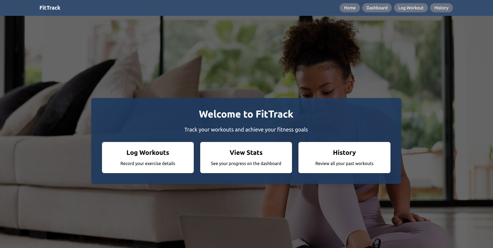

# 🏋️‍♀️ Fitness Tracker App

A simple and clean fitness tracking application built with **React**, **Tailwind CSS**, and **JSON Server**. Users can log workouts, view their history, and stay on top of their fitness goals.

## 🚀 Features

- 💪 Add a workout with type, duration, distance, and notes
- 📜 View workout history with dynamic icons and category colors
- 🌥️ Beautiful UI with background image and overlays
- 🔄 Uses `useState`, `useEffect`, props, and routing
- 🛠️ Data stored and fetched from a `db.json` file using `json-server`

---

## 🧱 Built With

-- **React** – Frontend library
- **React Router DOM** – Routing between pages
- **Tailwind CSS** – For styling
- **json-server** – Simulated backend (optional for full CRUD functionality)

## 📸 Screenshots

 


## 🛠️ Installation

1. **Clone the Repository**

```bash
git clone https://github.com/yourusername/fitness-tracker-app.git
cd fitness-tracker-app


2. **Install dependencies**

npm install
Run the JSON Server

npm install -g json-server
json-server --watch db.json --port 3001

3. **Start the app**


npm start


🧾 Pages & Components

Pages:
/ - Home

/dashboard - Dashboard with reminder and summary

/WorkoutPage - Add new workout

/historyPage - View workout history

Main Components:

WorkoutForm.jsx

DashboardStats.jsx

HistoryList.jsx

Navbar.jsx

ReminderCard.jsx


